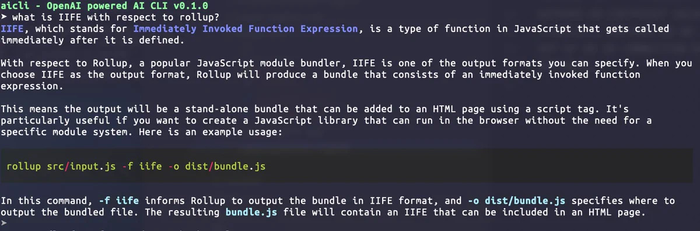

# aicli

[](https://pypi.python.org/pypi/samuelcolvin-aicli)
[](https://github.com/samuelcolvin/aicli)
[](https://github.com/samuelcolvin/aicli/blob/main/LICENSE)

## Installation

```bash
pip install samuelcolvin-aicli
```

## Usage

```bash
aicli
```

## Example


